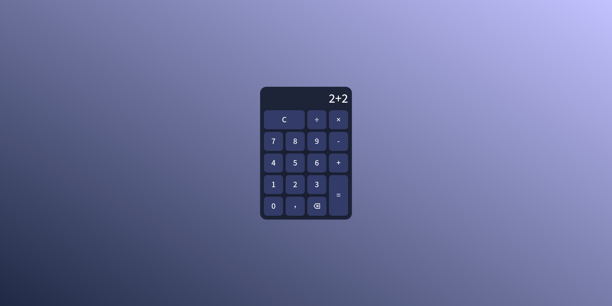

# 🚀 Calculadora Web

Uma calculadora simples que utiliza **Python (Flask)** para resolver cálculos matemáticos, com interface desenvolvida em **HTML** e **CSS**.

---

## 📌 Índice
- [Sobre o Projeto](#-sobre-o-projeto)
- [Funcionalidades](#-funcionalidades)
- [Tecnologias Utilizadas](#-tecnologias-utilizadas)
- [Como Executar](#-como-executar)
- [Pré-requisitos](#-pré-requisitos)
- [Licença](#-licença)

---

## 📖 Sobre o Projeto
> Este projeto foi desenvolvido com o objetivo de **aprimorar as habilidades de desenvolvimento web**, combinando HTML e CSS para a interface visual e Python (com Flask) para a lógica de processamento dos cálculos.

---



---

## ✨ Funcionalidades
- [x] Interface simples e responsiva  
- [x] Realiza operações matemáticas básicas (+, -, ×, ÷)  

---

## 🛠 Tecnologias Utilizadas
- **Design:** Figma  
- **Frontend:** HTML, CSS  
- **Backend:** Python (Flask)  
- **Controle de Versão:** Git & GitHub  

--- 

## 📚 Recursos Externos

- **Google fonte** - [Mada](https://fonts.google.com/specimen/Mada?query=Mada)
- **Google icons** - [Backspace](https://fonts.google.com/icons?query=Mada&selected=Material+Symbols+Outlined:backspace:FILL@0;wght@400;GRAD@0;opsz@24&icon.query=backspace&icon.size=24&icon.color=%23e3e3e3])


---

## ▶️ Como Executar

### 📋 Pré-requisitos
- Git instalado  
- Python 3.x  
- Gerenciador de pacotes (`pip`)  

### ⚙️ Passo a passo
```bash
# Clone este repositório
git clone https://github.com/seu-usuario/seu-projeto.git

# Acesse a pasta do projeto
cd seu-projeto

# Instale as dependências
pip install -r requirements.txt

# Execute a aplicação
python app.py
```

---

## 📜 Licença
Este projeto está sob a licença MIT. Veja o arquivo LICENSE